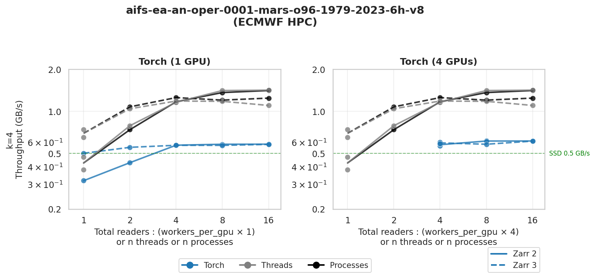
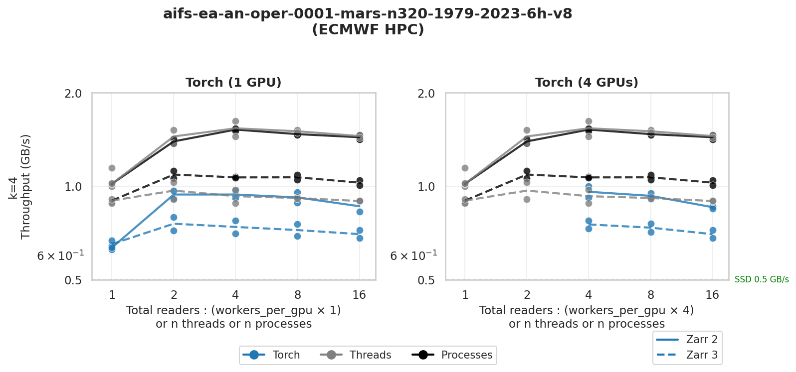
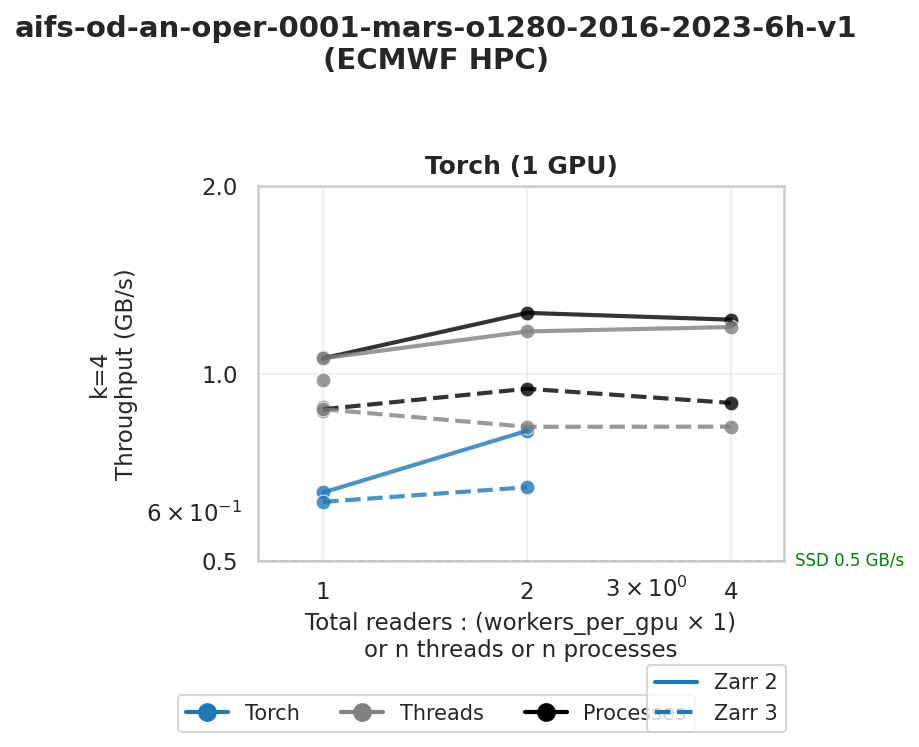

# Zarr Read Speed Benchmark

Compares **Zarr 2** vs **Zarr 3** read performance for anemoi-datasets on ECMWF HPC storage.

## Caveats

The raw Zarr read speeds (threads and processes modes) are useful for identifying bottlenecks, but they are **not the metric we ultimately care about**. What matters is actual training speed, which depends on many additional factors. A lower read throughput may be perfectly acceptable if training performance is good.

The PyTorch DataLoader runs are an attempt to get closer to realistic training conditions, but they are still synthetic benchmarks — no actual model is being trained.

The true performance metrics come from full HPC training benchmarks, which look at deeper indicators such as disk usage, I/O patterns at the filesystem level, and overall resource consumption. In a shared HPC environment, throughput depends on how many users are concurrently accessing the storage and network. Higher read speed is only beneficial if it does not come at disproportionate resource cost — e.g. achieving 2x speed while consuming 4x the shared resources is a net loss for the system.

## Experiment Setup

### Test Modes

| Mode | Implementation | Notes |
|------|----------------|-------|
| **threads** | `ThreadPoolExecutor` | Subject to GIL contention |
| **processes** | `ProcessPoolExecutor` | True parallel execution |
| **torch** | PyTorch DataLoader + DDP | Realistic ML training scenario |
| **anemoi** | PyTorch DataLoader + DDP + anemoi-training | Actual ML training (not implemented here) |

### Key Parameters

- `n=16`: Number of random samples to read (16 samples per worker provides statistical significance)
- Sample length `ds[i:i+4]` : Consecutive dates per sample
- **`workers 1 2 4 8 16`**: Worker counts to test scaling

### Heat Tracking

To benchmark **cold data** (not cached), the suite tracks previously-read indices in `data_heat/*.jsonl` and advances sequentially through the dataset. This prevents inflated throughput from cached reads.

## Results

### O96 Resolution - HPC Networked Storage

- Processes mode achieves ~1.5 GB/s at 16 workers
- Torch DataLoader throughput lower (~0.5-0.6 GB/s) due to overhead
- Zarr 2 and Zarr 3 show comparable performance

### O96 Resolution - SSD Storage

- **3-4x higher throughput** than HPC storage (up to ~4.5 GB/s)
- Processes mode scales well; threads cap at ~1.5 GB/s
- Torch DataLoader flat at ~0.6 GB/s (bottlenecked elsewhere)

### N320 Resolution - HPC Storage

- Higher resolution shows similar patterns
- Zarr 2 slightly outperforms Zarr 3 in torch mode

### O1280 Resolution - HPC Storage

- Very high resolution dataset, limited test runs
- Zarr 2: ~1.1 GB/s, Zarr 3: ~0.8 GB/s

## Conclusions

1. **Zarr 2 vs Zarr 3**: Generally comparable, Zarr 2 slightly better in some configurations
2. **Parallelisation**: Multi-process scaling effective up to ~16 workers
3. **Storage**: SSD provides 3-4x higher throughput than networked HPC storage
4. **PyTorch DataLoader**: Additional overhead reduces throughput vs raw parallel reads
