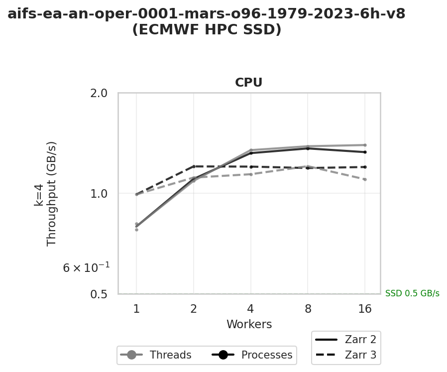
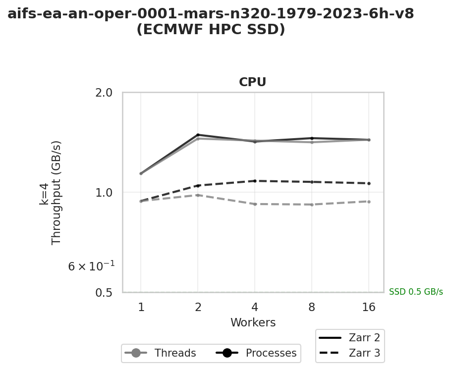

# Zarr Read Speed Benchmark

Compares **Zarr 2** vs **Zarr 3** read performance for anemoi-datasets on ECMWF HPC storage to read existing anemoi zarr 2 datasets.

## Experiment Setup

### Test Modes

| Mode | Implementation | Notes |
|------|----------------|-------|
| **threads** | `ThreadPoolExecutor` | Using multiple threads |
| **processes** | `ProcessPoolExecutor` | Using multiple processes |

### Key Parameters

- `n=16`: Number of random samples to read (16 samples per worker provides statistical significance)
- Sample length `ds[i:i+4]` : Consecutive dates per sample. Datasets chunking is 1 (1 chunk per index) in the first dimension and None in the other dimension (all indexes in the same chunk).
- **`workers 1 2 4 8 16`**: Worker counts to test scaling

### Heat Tracking

To benchmark **cold data** (not cached), the suite tracks previously-read indices in `data_heat/*.jsonl` and advances sequentially through the dataset. This prevents inflated throughput from cached reads.

## Caveats

The raw Zarr read speeds (threads and processes modes) are useful for identifying bottlenecks, but they are **not the metric we ultimately care about**. What matters is actual training speed, which depends on many additional factors. A lower read throughput may be perfectly acceptable if training performance is good.

The true performance metrics come from full training benchmarks, which look at deeper indicators such as disk usage, I/O patterns at the filesystem level, and overall resource consumption.

## Results

### O96 — Threads vs Processes (SSD)

- Zarr 2 threads scale best, reaching ~1.5 GB/s at 8–16 workers
- Zarr 2 processes reach ~1.5 GB/s at 8 workers, then drop slightly to ~1.35 GB/s at 16
- Zarr 3 plateaus at ~1.2 GB/s for both threads and processes, showing no benefit from additional workers beyond 2; Zarr 3 threads dips slightly to ~1.15 GB/s at 16
- At 1 worker, Zarr 3 starts ahead of Zarr 2 processes (~1.0 vs ~0.75 GB/s), but Zarr 2 overtakes as workers increase

### N320 — Threads vs Processes (SSD)

- Zarr 2 processes lead at low worker counts, starting at ~1.2 GB/s with 1 worker and peaking at ~1.5 GB/s with 2 workers, then settling at ~1.35–1.4 GB/s
- Zarr 2 threads starts lower (~0.95 GB/s at 1 worker) but scales up to ~1.35–1.4 GB/s at 4+ workers, converging with Zarr 2 processes
- Zarr 3 processes reach ~1.1 GB/s and plateau
- Zarr 3 threads stays flat at ~0.9 GB/s, suggesting GIL contention affects Zarr 3 specifically at this larger resolution
- Scaling is mostly flat beyond 2–4 workers for all modes

### N1280 Resolution

- N1280 testing is planned but has not yet been completed

## Conclusion

Across all resolutions and access patterns, **Zarr 2 consistently outperforms Zarr 3** in raw read throughput. Both Zarr 2 threads and processes scale well, reaching ~1.4–1.5 GB/s. Zarr 3, by contrast, plateaus earlier and lower (~1.1–1.2 GB/s), with Zarr 3 threads particularly affected at N320 resolution (~0.9 GB/s), suggesting GIL contention specific to Zarr 3's implementation.

That said, read throughput is only one piece of the puzzle. Real-world training performance depends on many interacting factors: data pipeline overlap with computation, memory pressure, chunk layout, compression codec behaviour, filesystem caching, and network contention. A slower raw read speed does not necessarily translate into slower training if the I/O is adequately hidden behind GPU computation.

**The only benchmark that truly matters is running actual training** and measuring end-to-end epoch time, GPU utilisation, and I/O wait. The synthetic results presented here are useful for spotting potential bottlenecks, but they should not be taken as definitive evidence that Zarr 3 will degrade training performance in practice.

Nonetheless, these results suggest that **further investigation is needed before upgrading safely to Zarr 3** in production training pipelines. A cautious approach — including full training benchmarks with representative model configurations — is recommended before any migration.
