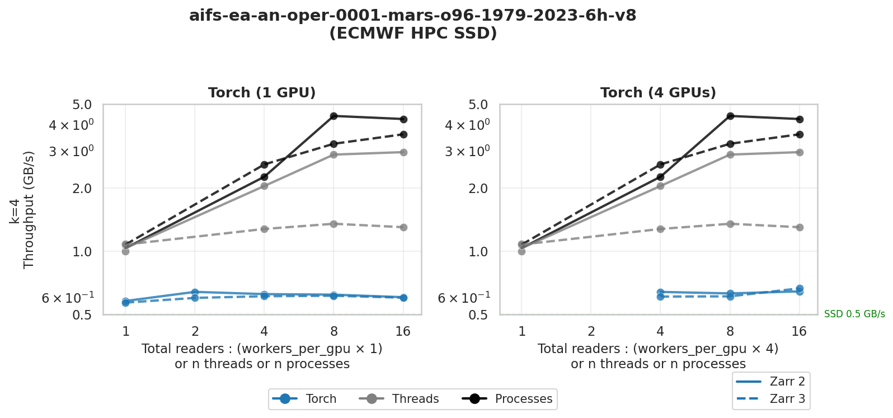
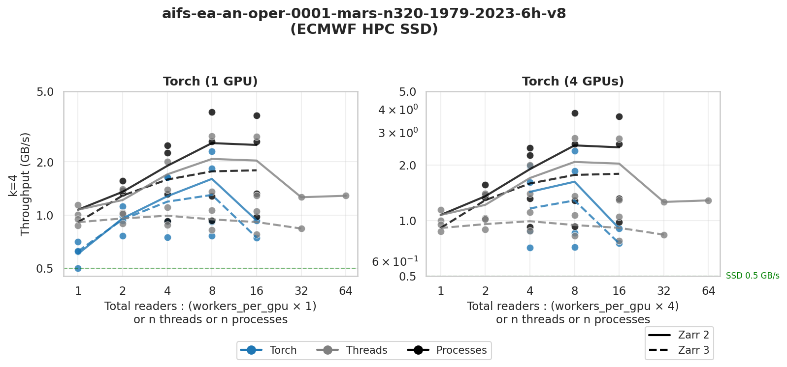

# Zarr Read Speed Benchmark — Torch Full Plots

This document presents the full throughput plots for **Zarr 2** and **Zarr 3** using PyTorch-based benchmarks on ECMWF HPC storage. It complements the main BENCHMARK.md by focusing on the end-to-end training scenario with GPU data loading.

These results are indicative and should be interpreted with caution, as the observed behavior may vary significantly depending on user load and other operational factors.

## Experiment Setup

- **Modes:** PyTorch DataLoader with multiple workers (GPU training context)
- **Datasets:** O96 and N320, stored on SSD
- **Metrics:** Throughput in GB/s, measured during actual training data loading
- **Worker counts:** 1, 2, 4, 8, 16 (where applicable)

## Results

### O96 — Torch Full Plot (SSD)

- Shows the full throughput scaling for Zarr 2 and Zarr 3 in a realistic training scenario.
- Compare with threads/processes results in BENCHMARK.md for context.

### N320 — Torch Full Plot (SSD)

- Larger dataset, more demanding I/O.
- Highlights differences in scaling and performance between Zarr 2 and Zarr 3 under heavy load.

## Interpretation

- Torch-based benchmarks reflect the actual data loading pattern during model training, including GPU transfer overheads.
- Use these plots to assess real-world impact of Zarr version choice on training speed, not just raw read throughput.

---

For threads/processes and more detailed breakdowns, see BENCHMARK.md.

## Next steps

- Experiment with tweaking the zarr 3 config (set number of thread inside zarr to 1, other).
- Experiment with zarrs in Rust.
